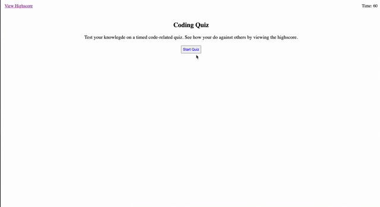

# Code Quiz

## Summary

The application is design to test your knowlegde of JavaScript. There are 10 multiple-choice questions. When the quiz is finished, you have the ability to save your score to compare against others.

## How To Use

Click start quiz to begin seeing questions and a 60 second timer. If the wrong answer is selected, there will be a 5 second deduction penalty. A score will be recorded for correct answer. At the end of the quiz, you will be shown your score and a section to input your name. Finally, you will be show the highscore of previous quiz takers.

The webpage changes are done through the JavaScript.

## Demo

### Technology Used:

- HTML
- CSS
- JavaScript

### Links

Deployed URL: https://kpegeder.github.io/code-quiz/

GitHub Code URL: https://github.com/kpegeder/code-quiz

### License - MIT
